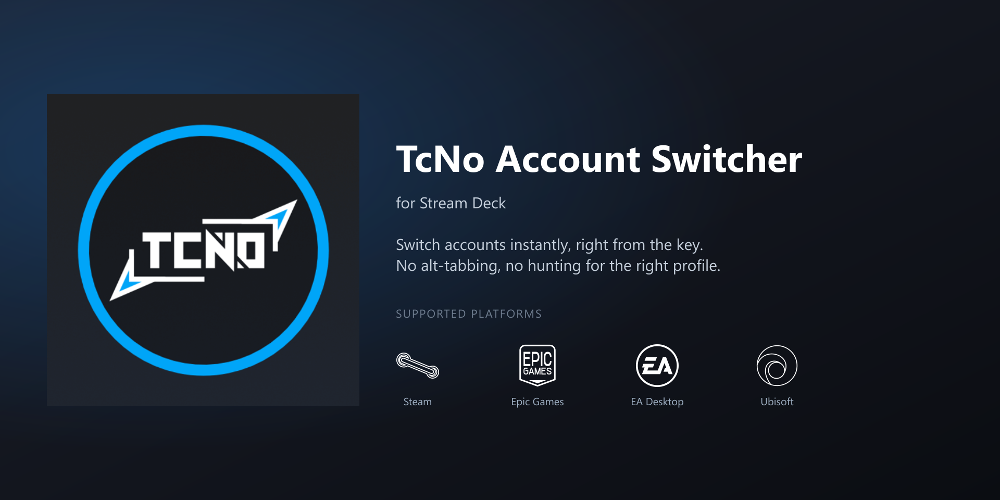
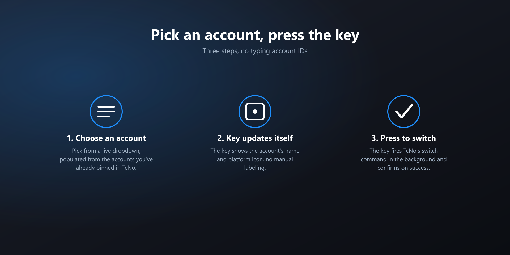
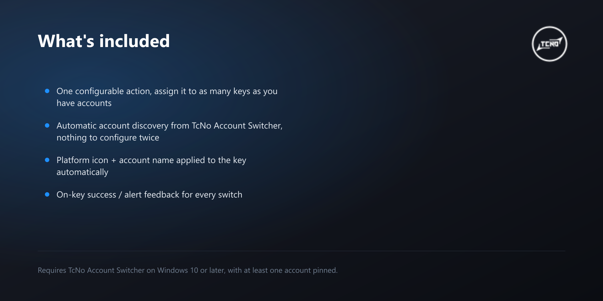

# TcNo Account Switcher - StreamDock / Stream Deck Plugin

Switch [TcNo Account Switcher](https://github.com/TCNOco/TcNo-Acc-Switcher) accounts (Steam, Epic Games, EA Desktop, Ubisoft) directly from a StreamDock or Elgato Stream Deck key.

## Gallery

## What it does

- One action, **Switch Account**: assign it a saved TcNo account, press the key, and TcNo switches to that account.
- The key's title and icon update automatically to match the selected platform.
- Accounts not yet tracked by TcNo show up in the picker tagged `(untracked)`, and self-heal once TcNo starts tracking them.

## Requirements

- Windows 10+
- [TcNo Account Switcher](https://github.com/TCNOco/TcNo-Acc-Switcher) installed at its default location
- StreamDock software 6.5+, or Elgato Stream Deck software

## Installation

Download the release for your device from the [Releases](../../releases) page and open it:

- StreamDock: `.sdPlugin` file
- Elgato Stream Deck: `.streamDeckPlugin` file

## Usage

1. Drag the **Switch Account** action onto a key.
2. Open the Property Inspector and pick an account from the dropdown.
3. Press the key to switch.

## Repo contents

This repo contains only the built, installable plugin (`manifest.json`, `bin/`, `imgs/`, `ui/`). Source code and build tooling live in a separate development repo.
