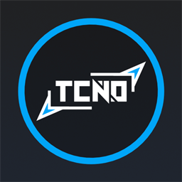

# TcNo Account Switcher

**Switch Steam, Epic Games, EA Desktop, and Ubisoft accounts instantly, right from a StreamDock or Elgato Stream Deck key.**

---

No more alt-tabbing into TcNo, hunting for the right profile, and waiting for it to relaunch the platform client. Pick an account once, and every switch after that is one key press.

## Gallery

## What it does

- 🔀 **One action, any account** — assign **Switch Account** to a key, pick a saved TcNo account, press to switch.
- 🖼️ **Self-labeling keys** — the key's title and icon update automatically to match the selected platform.
- 🩹 **Self-healing accounts** — accounts not yet tracked by TcNo show up tagged `(untracked)` and clean themselves up once TcNo starts tracking them.
- ✅ **Clear feedback** — a checkmark on success, an alert if the switch couldn't be started.

## Requirements

| | |
|---|---|
| OS | Windows 10 or later |
| Required app | [TcNo Account Switcher](https://github.com/TCNOco/TcNo-Acc-Switcher), with at least one account pinned |
| Device software | StreamDock 6.5+, or Elgato Stream Deck software |

## Installation

Grab the latest release for your device from **[Releases](../../releases/latest)**:

| Device | File |
|---|---|
| StreamDock | `.sdPlugin` |
| Elgato Stream Deck | `.streamDeckPlugin` |

Double-click the downloaded file to install.

## Usage

1. Drag the **Switch Account** action onto a key.
2. Open the Property Inspector and pick an account from the dropdown.
3. Press the key to switch.

## Repo contents

This repo contains only the built, installable plugin (`manifest.json`, `bin/`, `imgs/`, `ui/`). Source code and build tooling live in a separate development repo.

---

Not affiliated with TcNo Account Switcher, Elgato, or any platform listed above.

